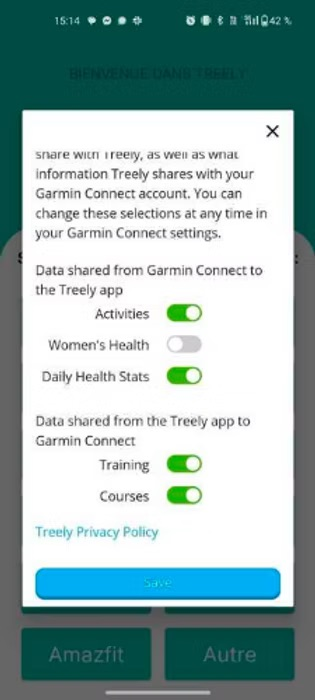

# Help — Treely Android FAQ

Contact us directly if you have a question or a technical issue: **[contact@treelyapp.com](mailto:contact@treelyapp.com)**

*Lire en français*

---

## My steps are not counted in Treely (Android)

If your steps are not counted, it's probably that you're missing Google Fit.

Google Fit is a free app created by Google that allows your phone to count your steps.

It's pretty simple from here:

1. Install Google Fit on your device and set it up.
2. Restart the Treely app.
3. You sometimes need to restart your phone.

And you're all set.

If you have Google Fit installed but still have trouble with your steps, email us at [contact@treelyapp.com](mailto:contact@treelyapp.com)

---

## Can I use my smartwatch?

Of course! You can connect the most common smartwatches directly within the app.

Alternatively, you need to connect your watch to Google Fit and your steps will be counted.

- ✅ simply connect your connected watch app to Apple Health
- ✉️ contact us: [contact@treelyapp.com](mailto:contact@treelyapp.com)

---

## Connected watch: why aren't my steps syncing?

Here are the most common issues our participants face.

**1. Need to sync manually first**

Once your watch is connected, you must manually sync it from your Watch app the first time.

After that, your steps will automatically sync with the app a few times daily as soon as your provider sends the data.

**2. Wrong account when logging in**

Please double-check that the account you used to connect your watch to the Treely app is the same one you're using in your Watch app.

It's easy to accidentally log into a different account without noticing, preventing the steps from syncing correctly.

**3. Set the rights in settings**

Please ensure that you allowed Treely to receive all your data types from your watch (including Activities, Steps...).

Here's an example for Garmin 👇

---

## Strava activities not synching to Google Fit?

Strava send activity time, distance, and calories to Google Fit only when the data is downloaded from the server.

To do this:

1. **Load the information in Strava:** First, open your Strava app and go to the "You" Feed. Scroll through your recent activities to make sure they are loaded and displayed on your feed.
2. **Access it in Google Fit:** Then, open your Google Fit app. It may take a few moments for the activities to appear.

If you find that your activity has not synced to Google Fit after using the steps above, it will be necessary to edit the activity on Strava to trigger the sync action. Once you save the activity again it should push over to Google Fit.
