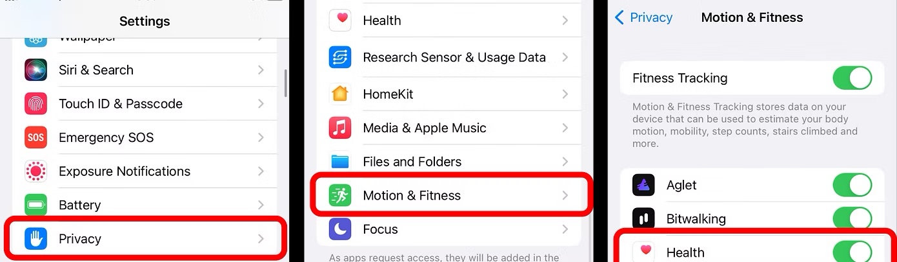
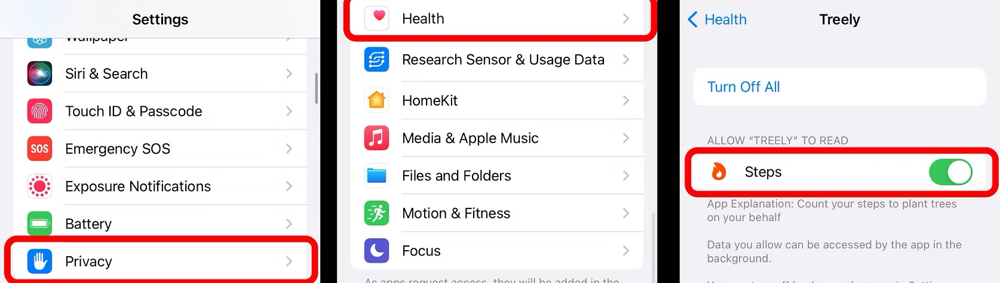
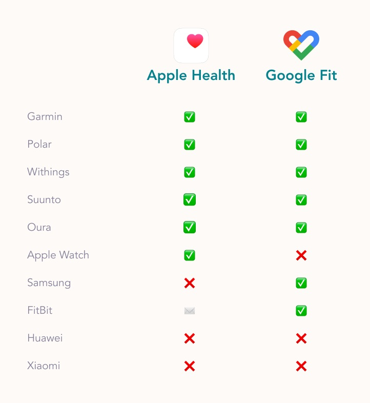

# Help — Treely iOS FAQ

Contact us directly if you have a question or a technical issue: **[contact@treelyapp.com](mailto:contact@treelyapp.com)**

*Lire en français*

---

## My steps are not counted in Treely (iOS)

**1. Make sure your steps are counted in Health.**

If not, go to: `Settings > Privacy > Motion & Fitness`. And activate Health.

**2. Make sure Treely has access to Health.**

Go to: `Settings > Privacy > Health`. And authorise Treely to access your steps.

---

## Can I use my smartwatch?

Of course! You just need to connect your watch to Apple Health and your steps will be counted.

In order to do that, go to your watch official application and connect it to Apple Health.

- ✅ simply connect your connected watch app to Apple Health (easy)
- ✉️ contact us: [contact@treelyapp.com](mailto:contact@treelyapp.com)

---

## Strava activities not synching to Apple Health?

Strava send activity time, distance, and calories to Apple Health only when the data is downloaded from the server.

To do this:

1. **Load the information in Strava:** First, open your Strava app and go to the "You" Feed. Scroll through your recent activities to make sure they are loaded and displayed on your feed.
2. **Access it in Apple Health:** Then, open your Health app. It may take a few moments for the activities to appear.

If you find that your activity has not synced to Health after using the steps above, it will be necessary to edit the activity on Strava to trigger the sync action. Once you save the activity again it should push over to Health.
